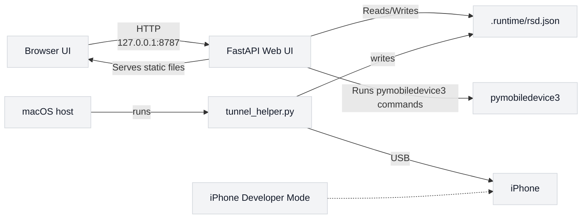

# iPhone GPS Controller — uv + Python 3.13

macOS 上的 iPhone GPS 模擬 Web UI，使用 pymobiledevice3 與 FastAPI。專為 iOS 17/18 的 RSD tunnel 設計，可避免系統 Python 3.9 / LibreSSL 的相容性問題。

## 先決條件：啟用 iPhone 開發者模式

使用前請在 iPhone 上啟用開發者模式。

### iOS 17/18

1. 連接 iPhone 到 macOS
2. 開啟「設定」→「隱私與安全」
3. 啟用「開發者模式」
4. 若系統要求重啟，請重啟並重新解鎖 iPhone

### iOS 26（若適用）

若在 iOS 26 找不到開發者選項，請在設定內搜尋 "Developer Mode"，並確認已插入 USB 並且已信任該電腦。

注意：Apple 要求在裝置上明確授權開發者模式，無法由工具自動完成。

## 專案特色

- Docker 化的 FastAPI Web UI
- 透過 `pymobiledevice3` 控制 iPhone GPS 模擬
- 支援 iOS 17/18 的 RSD tunnel 模式
- 避免 macOS 系統 Python 3.9 / LibreSSL 問題
- 需要 USB 連線與已授權的 iPhone

## 安裝與準備

### 1. 安裝依賴

```bash
brew install uv
make install
```

這會建立 `uv` 虛擬環境並安裝所需套件：

```bash
uv python install 3.13
uv venv --python 3.13
uv sync
uv pip install -U pymobiledevice3
```

### 2. 驗證環境

```bash
make doctor
```

預期輸出：

```text
✅ Python 3.13.x
✅ OpenSSL 3.x.x
✅ pymobiledevice3 import OK
✅ runtime doctor passed
```

## 啟動服務

### 快速開始（推薦）

```bash
make start
```

此命令會：

- 檢查必要依賴
- 啟動 macOS Tunnel helper（背景執行）
- 啟動 Docker Web UI
- 等待服務就緒
- 自動打開瀏覽器

停止服務：

```bash
make stop
```

### 手動啟動（進階）

#### 本機 Web UI

```bash
make run
```

這會啟動本機 FastAPI Web UI，並嘗試自動啟動 `tunnel_helper.py`。若自動啟動失敗，Web UI 會顯示備援指令。

#### Docker Web UI

由於 Docker Desktop 在 macOS 上無法穩定存取 USB iPhone，Docker 模式仍需要在 macOS host 端執行 tunnel helper。

##### 1) 啟動 Web UI

```bash
make docker-up
```

然後打開瀏覽器：

```text
http://127.0.0.1:8787
```

##### 2) 啟動 macOS Tunnel helper

```bash
make tunnel
```

此程序必須保持開啟。
它會解析 iPhone 連線資訊，並將結果寫入：

```text
.runtime/rsd.json
```

Docker container 的 Web UI 會透過 bind mount 讀取此檔案。

## 常用命令

- `make doctor`：檢查 Python 與 `pymobiledevice3`。
- `make tunnel-status`：查看 `.runtime/rsd.json` 目前狀態。
- `make tunnel-log`：追蹤 tunnel helper 日誌。
- `make docker-logs`：追蹤 Docker Web UI 日誌。
- `make docker-rebuild`：重新建立 Docker 映像。
- `make clean-runtime`：刪除 `.runtime/rsd.json` 與 `.runtime/tunnel.log`。
- `make install-brew-python`：若不想使用 `uv`，改用 Homebrew Python 3.13。

## 使用流程

### 首次設置

1. `brew install uv`
2. `make install`

### 啟動服務

3. `make start`

### 操作 GPS 模擬

4. 在 Web UI 中點選 `Mount image`
5. 在地圖上選擇位置或輸入緯度/經度
6. 點選 `Set Location`

### 停止服務

7. `make stop`

## 運作方式

這個專案採用混合架構：

- Docker container：FastAPI Web UI
- macOS host：`pymobiledevice3` tunnel helper
- 共用檔案：`.runtime/rsd.json`

## 專案架構圖



## 常見問題

- 若出現「Developer Mode is not enabled」：請確認 iPhone 已開啟開發者模式並重新啟動。
- 若出現「No usable iPhone connection」：請解鎖 iPhone、信任此電腦、重新插拔 USB。
- 若出現 `SSLError: No cipher can be selected`：請確認使用 `uv` + Python 3.13，而非系統 Python 3.9。
- 若 `make start` 失敗：請先單獨執行 `make tunnel`，確保 `.runtime/rsd.json` 已建立。

## 授權條款

本專案採用 MIT 授權，詳見專案根目錄中的 `LICENSE` 檔案。

## 其他備選

若不想使用 `uv`，可以嘗試：

```bash
make install-brew-python
```

這會改用 Homebrew 的 Python 3.13 安裝方式。
