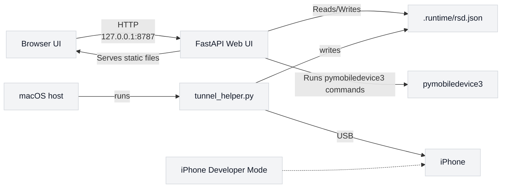

# iPhone GPS Controller - uv + Python 3.13 版本

這是一個針對 macOS 的 iPhone GPS 模擬 Web UI，使用 `pymobiledevice3` 與 FastAPI 提供圖形化控制介面。它專門為 iOS 17/18 的 RSD tunnel 路徑設計，避免 macOS 系統 Python 3.9 / LibreSSL 的相容性問題。

## 先決條件：開啟 iPhone 開發者模式

在使用本專案前，必須先在 iPhone 上手動開啟開發者模式。

### iOS 17/18 的通用步驟

1. 連接 iPhone 到 macOS
2. 開啟 iPhone「設定」
3. 進入「隱私與安全」
4. 開啟「開發者模式」
5. 若系統要求重開機，請照指示重啟並重新解鎖 iPhone

### iOS 26 的步驟

在 iOS 26 上，開發者模式的顯示方式可能和舊版略有不同，請參考以下步驟：

1. 連接 iPhone 到 macOS
2. 開啟 iPhone「設定」
3. 使用設定搜尋框輸入「Developer Mode」或「開發者模式」
4. 若未顯示，請確認已插連 USB 並信任這台電腦
5. 進入「隱私與安全」或「開發者」選單，啟用「開發者模式」
6. 若系統要求重開機，請照指示重啟並重新解鎖 iPhone

> Apple 要求在裝置上明確授權開發者模式，工具無法自動完成此步驟。

## 專案特色

- Docker 化的 FastAPI Web UI
- 透過 `pymobiledevice3` 控制 iPhone GPS 模擬
- 支援 iOS 17/18 的 RSD tunnel 模式
- 避免 macOS 系統 Python 3.9 / LibreSSL 問題
- 需要 USB 連線與已授權的 iPhone

## 安裝與準備

### 1. 安裝 uv 與本地執行環境

```bash
brew install uv
make install
```

這會執行：

```bash
uv python install 3.13
uv venv --python 3.13
uv sync
```

### 2. 驗證環境

```bash
make doctor
```

預期輸出：

```text
✅ Python 3.13.x
✅ OpenSSL 3.x.x
✅ pymobiledevice3 import OK
✅ runtime doctor passed
```

## 啟動服務

### 快速開始（推薦）

只需一條指令：

```bash
make start
```

此命令會自動執行以下操作：
- 檢查必要依賴
- 啟動 macOS Tunnel helper（背景運行）
- 啟動 Docker Web UI
- 等待服務就緒
- 自動打開瀏覽器

停止服務：

```bash
make stop
```

### 手動啟動（進階）

如果需要分步操作或除錯，可使用以下命令：

#### 本機 Web UI（會自動嘗試啟動 tunnel）

```bash
make run
```

使用本機 FastAPI Web UI 時，Web 服務啟動後會自動嘗試啟動 `tunnel_helper.py`。若 macOS 權限或環境限制導致自動啟動失敗，Web UI 會顯示備援指令。

#### Docker Web UI

Docker Desktop 在 macOS 上無法穩定存取 USB iPhone，因此 Docker 模式仍需要 macOS host 端的 tunnel helper。建議直接使用：

```bash
make start
```

若要分步操作：

##### 1) 啟動 Web UI

```bash
make docker-up
```

然後打開瀏覽器：

```text
http://127.0.0.1:8787
```

##### 2) 啟動 macOS Tunnel helper

在第二個終端機執行：

```bash
make tunnel
```

此程序必須保持開啟。

它會解析 iPhone 連線資訊，並將結果寫入：

```text
.runtime/rsd.json
```

Docker container 的 Web UI 透過 bind mount 讀取此檔案。

## 使用流程

### 首次設置

1. `brew install uv`
2. `make install`

### 啟動服務

3. `make start` （自動完成下列步驟）
   - 啟動 Tunnel helper
   - 啟動 Docker Web UI
   - 打開瀏覽器

### 操作 GPS 模擬

4. 在 Web UI 中點選 `Mount image`
5. 在地圖上選擇位置或輸入緯度/經度
6. 點選 `Set Location`

### 停止服務

7. `make stop` （停止所有服務）

## macOS 與 Docker 模式說明

由於 Docker Desktop 在 macOS 上無法穩定存取 USB iPhone 與 Apple 開發者服務，因此採用混合方式：

- Docker container：FastAPI Web UI
- macOS host：`pymobiledevice3` tunnel helper
- 共用檔案：`.runtime/rsd.json`

## 專案架構圖



## 常見問題

- 若出現「Developer Mode is not enabled」：請確認 iPhone 已開啟開發者模式並重新啟動。
- 若出現「No usable iPhone connection」：請解鎖 iPhone、信任此電腦、重新插拔 USB。
- 若出現 `SSLError: No cipher can be selected`：請確認使用 `uv` + Python 3.13，而非系統 Python 3.9。

## 其他備選

若不想使用 `uv`，可以嘗試：

```bash
make install-brew-python
```

這會改用 Homebrew 的 Python 3.13 安裝方式。
